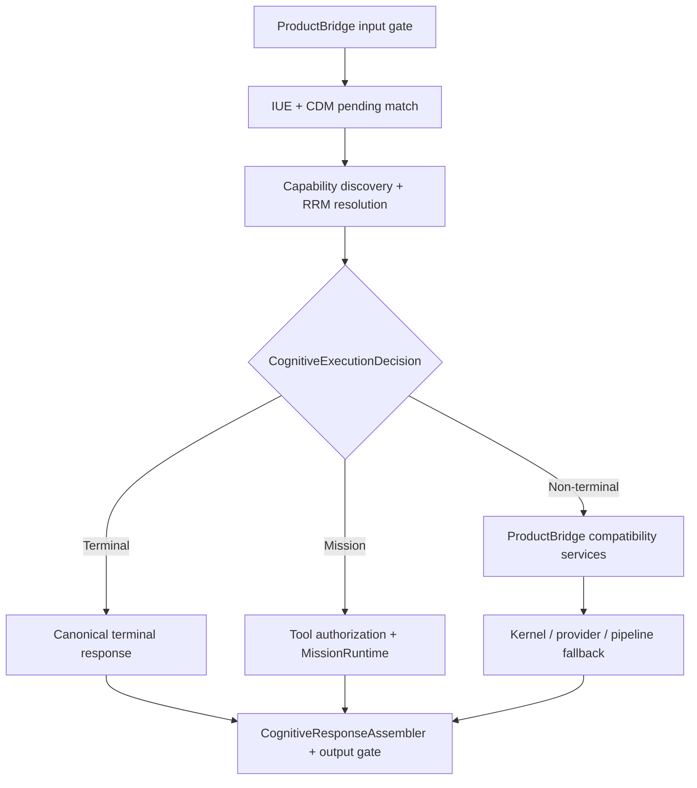

# Runtime Authority Map

## Snapshot and scope

This map describes the executable repository state at commit
`245c40b5ac640f7b38066f5586a8ad0da7756eef` on
`architecture/runtime-authority-convergence`. It is an observed-current-state map,
not a target architecture diagram. The companion
[`runtime_authority_map.json`](runtime_authority_map.json) is the machine-readable
source for the same findings.

Movement 11.1 changes no runtime behavior. Reachability was established from the
composition root, the ProductBridge chat path, direct Kernel entry points, and
runtime call sites. A class being constructed, tested, or exposed through a
diagnostic action was not treated as product authority by itself.

The authority dimensions are: interpretation, context, memory, capability
discovery, resource truth, capability selection, provider selection, agent
selection, Mission lifecycle, authorization, execution, verification, response
construction, and persistence.

## Classification vocabulary

| Classification | Meaning in this map |
| --- | --- |
| `CANONICAL_AUTHORITY` | The intended decision owner is active for the stated scope. |
| `EXECUTION_BINDING` | Knows how to invoke an already-selected resource; must not redefine eligibility. |
| `COMPATIBILITY_ONLY` | Retained legacy behavior; valid only after canonical routing permits it. |
| `PROJECTION` | Derived/read-only view of another authority. |
| `TRANSPORT_ONLY` | Carries or serializes data without deciding semantic meaning. |
| `PERSISTENCE_ONLY` | Stores state owned by another component. |
| `DIAGNOSTIC_ONLY` | Reachable for inspection or planning evidence, not controlling product action. |
| `DEAD_OR_UNREACHABLE` | Not reachable from the composed ProductBridge product path at this snapshot. |
| `AUTHORITY_CONFLICT` | Makes a decision that overlaps or can diverge from the intended canonical owner. |

Absence of a dimension means the component has no current authority over that
dimension. “Canonical” is scoped: for example, AME is the canonical cognitive
memory engine, while the product still has a system-level conflict because PKB and
session `known_context` also persist overlapping facts.

## Real controlling product path

The terminal and Mission branches are authoritative before compatibility in
`ProductBridge._chat`. The non-Mission branch remains distributed: ProductBridge
performs memory recognition/retrieval, BCC selection, finance/application field
filling, zero-provider behavior, session persistence, and provider fallback before
or around `Kernel.process`. This is the primary authority conflict for Movement 11.

## Executive findings

1. **There is one authoritative cognitive decision, but not yet one end-to-end
   runtime authority.** `CognitiveCapabilityRuntime` owns the terminal/Mission mode
   decision. Non-terminal conversation semantics still branch inside ProductBridge.
2. **ProductBridge is an authority-conflicted orchestrator, not yet a transport
   adapter.** It constructs semantic responses and Mission/session meaning as well
   as serializing the final envelope.
3. **RRM is authoritative for capability-resolution truth, but not for all
   execution-time truth.** ProviderManager, CanonicalCapabilityRegistry, the Core
   App router, the tool registry, and the agent orchestrator hold independent
   binding/health/availability views.
4. **Mission lifecycle and Mission execution are separate, but completion is not
   fully consolidated.** MissionRuntime uses VerificationGate and
   MissionCompletionGate; Kernel and LegacyCapabilityExecutorAdapter can call
   `MissionEngine.complete()` directly, while ProductBridge also writes local
   `mission_status="completed"` session records.
5. **Persistent cognitive memory is AME/KOM, but durable truth is still parallel.**
   Kernel PKB persists curated events and ProductBridge session JSON persists
   `known_context`. No reconciliation contract currently makes those stores a
   single memory truth.
6. **The final output gate is canonical, but response meaning is distributed.**
   Every ProductBridge chat response reaches `CognitiveResponseAssembler`; the
   text, status, provenance, confidence, and Mission semantics are still authored
   by several upstream components.

## Component authority matrix

The detailed evidence and per-dimension classifications are in the JSON map.

| Component | Product reachability | Current authority / role | Primary classification | Intended disposition |
| --- | --- | --- | --- | --- |
| ProductBridge | Active product entry | interpretation, context, memory, provider selection, Mission/session lifecycle, execution dispatch, response construction, persistence | `AUTHORITY_CONFLICT` | Reduce to interface/session transport and CognitiveResponse serialization. |
| Kernel | Active fallback; direct API | legacy interpretation, provider selection, canonical capability execution, PKB ingestion, pipeline response | `AUTHORITY_CONFLICT` | Consume canonical decisions; stop selecting providers or completing Missions independently. |
| IntentEngine | Active inside Kernel fallback | domain/mode interpretation | `COMPATIBILITY_ONLY` | Keep as explicit compatibility parser only. |
| IUE | Active product path | structured interpretation and contextual projection | `CANONICAL_AUTHORITY` | Remain interpretation owner; remove downstream reinterpretation. |
| CDM | Active pending-dialogue match; diagnostic full evaluation | typed continuation/context decision | `CANONICAL_AUTHORITY` | Move dialogue ownership out of ProductBridge into the conversation runtime. |
| AME | Active ProductBridge memory path | project-scoped cognitive memory and persistence | `CANONICAL_AUTHORITY` | Remain durable cognitive memory owner; integrate PKB governance. |
| KOM | Active as AME data contract | semantic memory model, provenance, sensitivity, lifecycle | `PROJECTION` | Remain canonical data contract; it does not orchestrate. |
| Session JSON store | Active ProductBridge path | dialogue/session persistence plus overlapping `known_context` | `AUTHORITY_CONFLICT` | Restrict to transient runtime/dialogue state. |
| PKB / KnowledgeManager | Active Kernel fallback | curated knowledge ingestion/query and durable store | `AUTHORITY_CONFLICT` | Become governed curation/read-through layer over memory ownership. |
| KnowledgePipeline | Active Kernel and execution service | Constitution-curated knowledge transformation and persistence | `CANONICAL_AUTHORITY` | Retain curation authority; do not become parallel user-memory truth. |
| CapabilityRequirementDiscovery | Active product path | capability requirement discovery | `CANONICAL_AUTHORITY` | Remain the single discovery contract behind the cognitive runtime. |
| CapabilityFirstResolver | Active product path | capability composition using RRM | `CANONICAL_AUTHORITY` | Remain selection/composition owner; require execution-time RRM revalidation. |
| CognitiveCapabilityRuntime | Active product path | authoritative execution mode and composition | `CANONICAL_AUTHORITY` | Remain cognitive route authority. |
| CPE | Active as ECC planning evidence | plan generation with domain/keyword rules | `DIAGNOSTIC_ONLY` | Become canonical Mission planner only after capability-plan parity is proven. |
| COR | Active as ECC planning evidence | agent/provider/environment ranking from its own catalog | `AUTHORITY_CONFLICT` | Consume RRM projections; stop using independent default resource truth. |
| ECC | Diagnostic endpoint and Mission planning evidence | supervises IUE/CDM/CPE/COR but does not control ProductBridge execution | `DIAGNOSTIC_ONLY` | Define a single Mission supervision boundary in 11.3. |
| BCC | Active local response path | capability/help response content using AME | `COMPATIBILITY_ONLY` | Become a content service invoked by canonical conversation authority. |
| RRM | Active capability resolution and ActionGate | resource existence/eligibility truth | `CANONICAL_AUTHORITY` | Become mandatory resource truth at selection and immediately before execution. |
| ProviderManager | Active Kernel/provider binding | provider registry, default/fallback selection, invocation tracking | `AUTHORITY_CONFLICT` | Invocation binding only; RRM/resolver select eligible provider. |
| CanonicalCapabilityRegistry | Active direct Kernel Mission route | capability-to-executor binding and first-entry selection | `AUTHORITY_CONFLICT` | Binding lookup only, constrained by RRM eligibility. |
| Core App CapabilityRouter | Active direct Kernel Mission route | Core App binding/dispatch; retains Domain defaults when capability omitted | `AUTHORITY_CONFLICT` | Explicit capability binding only; deprecate Domain default authority. |
| Tool CapabilityRouter | Not composed into ProductBridge | tool registry, health, permission scoring | `DEAD_OR_UNREACHABLE` | Project RRM truth into binding selection before activation. |
| CanonicalAgentOrchestrator | Active direct Kernel Mission route | agent registry, selection, bounded invocation | `AUTHORITY_CONFLICT` | Invocation binding only; RRM/resolver select eligible agent. |
| ModuleRouter | Active Kernel pipeline compatibility | Domain/trigger/module selection | `COMPATIBILITY_ONLY` | Explicit observable fallback only; never override cognitive decisions. |
| LegacyCapabilityExecutorAdapter | Composed compatibility path | Domain-to-capability conversion, execution, direct Mission completion | `COMPATIBILITY_ONLY` | Keep isolated until canonical parity, then retire direct completion. |
| CapabilityExecutionService | Direct Kernel Mission path | registration selection and app/agent/provider dispatch | `EXECUTION_BINDING` | Execute only an RRM-validated canonical resolution. |
| MissionEngine | Active product Mission path | Mission identity and lifecycle store | `CANONICAL_AUTHORITY` | Remain lifecycle owner; gate `complete()` with verified completion evidence. |
| MissionRuntime | Active authorized synthetic Mission path | DAG execution, ActionGate, verification, runtime checkpoints | `CANONICAL_AUTHORITY` | Remain controlled execution owner and synchronize lifecycle through MissionEngine. |
| ToolRegistry | Not composed into ProductBridge resolver | independent tool/resource status and capability mapping | `DEAD_OR_UNREACHABLE` | Binding projection of RRM, not a competing availability registry. |
| ToolAuthorizationGate | Active ProductBridge Mission path | tool/resource authorization | `CANONICAL_AUTHORITY` | Remain authoritative and become composition-owned rather than instantiated by bridge. |
| ActionGate | Active inside MissionRuntime | action-level policy, resource revalidation, confirmation | `CANONICAL_AUTHORITY` | Remain final pre-execution action boundary. |
| VerificationGate | Active after executor | node result verification | `CANONICAL_AUTHORITY` | Remain node verification owner. |
| MissionCompletionGate | Active inside MissionRuntime | verified runtime completion | `CANONICAL_AUTHORITY` | Become the only evidence source permitted to complete MissionEngine lifecycle. |
| CognitiveResponseAssembler | Active for every ProductBridge chat response | canonical envelope normalization and `response.output` gate | `CANONICAL_AUTHORITY` | Accept semantic results from conversation/Mission services; bridge only serializes. |
| CanonicalConstitutionEngine | Active throughout product path | policy decisions for input, memory, resolution, Mission, tools, actions, output | `CANONICAL_AUTHORITY` | Remain universal governance authority. |
| PipelineDAG | Active Kernel fallback | legacy staged execution and final text delivery | `COMPATIBILITY_ONLY` | Explicit compatibility execution whose output is wrapped canonically. |

## Confirmed authority conflicts

| Conflict | Evidence | Consequence | Checkpoint owner |
| --- | --- | --- | --- |
| ProductBridge vs conversation runtime | `_chat` owns memory query detection, BCC routing, finance/app parsing, status/Mission ID and session writes | Non-Mission semantic meaning has no single owner | 11.2 |
| Mission completion has four writers | `MissionRuntime`, `Kernel._execute_canonical_route`, `LegacyCapabilityExecutorAdapter`, and ProductBridge session records | “completed” can mean verified runtime completion, direct lifecycle completion, or only a local response | 11.3 |
| RRM vs binding registries | RRM is now enforced by `CanonicalResourceBindingAuthority`; invocation registries retain callable objects only | Registration, configuration, and executor health cannot upgrade RRM-unavailable resources | 11.4 implemented; provider lifecycle convergence remains 11.6 |
| AME vs PKB vs session context | `CanonicalMemoryService` exposes AME/KOM as durable authority; PKB is curation/projection and session `known_context` is transient | Corrections use scoped authority keys, preserve history, and do not create a parallel PKB current truth | 11.5 implemented |
| CognitiveResponseAssembler vs upstream authors | Services still construct content/evidence, while `CognitiveResponseAssembler.from_result` owns status aliases, epistemic/confidence defaults and provider provenance | ProductBridge serializes the governed envelope rather than assigning semantic defaults | 11.6 implemented |
| COR RegistryCatalog vs RRM | ProductBridge ECC/COR uses `RegistryCatalog(populate_defaults=True)` | Diagnostic plans can describe agents/providers that are not RRM runtime truth | 11.3/11.4 |
| Core App Domain defaults | `core_apps.router.CapabilityRouter._DOMAIN_DEFAULTS` remains callable when capability is omitted | A future caller could reintroduce Domain-controlled selection | 11.4/11.7 |

## ProductBridge migration ledger

| Current ProductBridge responsibility | Canonical owner | Current authority | Target authority | Migration status at 11.1 | Required parity test |
| --- | --- | --- | --- | --- | --- |
| Invoke IUE and construct its session context | IUE + canonical conversation service | Bridge orders invocation and supplies derived context | Bridge transports input; conversation service invokes IUE | Partially delegated | Same StructuredIntent and terminal route through real ProductBridge path. |
| Match and persist pending dialogue | CDM + canonical conversation service | CDM types answers; Bridge decides persistence/resume ID | Conversation service owns dialogue transition; session store persists projection | Partially delegated | Valid, false-positive, ambiguous, and independent-intent pending cases preserve Mission isolation. |
| Recognize and ingest memory facts | AME/KOM with KnowledgePipeline governance | Bridge keyword/regex recognition and direct AME write | Conversation service proposes typed candidates; governed memory owner commits | Not started | Preference/project fact/correction/restart/project-isolation tests. |
| Detect memory queries and construct memory response | AME/KOM + conversation service | Bridge keyword detection, retrieval, formatting, status | Conversation service requests AME context and returns CognitiveResponse | Not started | Query vs fact, UNKNOWN, sensitivity, expiry, and no Mission tests. |
| Select BCC/local capability response | Conversation service invoking BCC | Bridge regexes BCC first-run patterns and formats result | Cognitive decision selects LOCAL_RESPONSE; service invokes BCC content | Partially delegated | “O que você consegue fazer?” stays local, governed, provider-free, Mission-free. |
| Financial parsing and field filling | CDM + typed conversation policies | Bridge money parser, keyword extraction, field state machine | Typed continuation and conversation policies outside bridge | Not started | Existing complete finance flow plus marker-collision and unrelated-intent regressions. |
| Application/product parsing and field filling | CDM + typed conversation policies | Bridge keyword parsing and field state machine | Typed continuation and conversation policies outside bridge | Not started | Existing application multi-turn flow and spreadsheet-not-app regression. |
| Create/resume/expose Mission IDs | MissionEngine + Mission conversation coordinator | Bridge generates UUIDs, persists IDs, chooses resume ID | MissionEngine owns identity; response exposes only related Mission ID | Partially delegated | Terminal/local/unrelated requests never reuse or expose pending Mission IDs. |
| Evaluate tool authorization | ToolAuthorizationGate in Mission service | Bridge constructs candidate/tool and instantiates gate | Mission service selects RRM resource then invokes composed gate | Partially delegated | Every authorization state; only ALLOW reaches MissionRuntime. |
| Invoke MissionRuntime | Canonical Mission service | Bridge creates synthetic RuntimeNode and calls runtime | Mission coordinator hands an authorized plan to MissionRuntime | Partially delegated | Synthetic email/filesystem authorization, confirmation, execution and verification invariants. |
| Configure provider fallback | CanonicalProviderAuthority over RRM; ProviderManager invocation binding | Bridge supplies preferences only; canonical authority selects/revalidates primary/fallback | RRM authority selects eligible provider; manager invokes only that immutable selection | Implemented for ProductBridge/Kernel product path | Zero-provider, unhealthy provider, explicit fallback and provenance tests. |
| Zero-provider handling | CognitiveCapabilityRuntime + RRM + conversation service | Cognitive terminal decision is canonical; Bridge also rewrites mock output | One truthful canonical response from resource resolution | Partially delegated | XZ-91, Iceland 2025, external reasoning, no provider fiction. |
| Author response meaning | Conversation/Mission runtime + CognitiveResponseAssembler | Services create content/evidence; assembler normalizes semantic status/provenance | Services supply semantic results; assembler normalizes/governs; bridge serializes | Implemented for product envelope | All major sources produce consistent status, epistemic state, provenance, limitations. |
| Persist session JSON and `known_context` | Session store as transient persistence projection | Bridge defines schema and writes Mission status plus context | Session store persists dialogue/runtime projections only | Not started | Restart continuity without duplicate durable truth or project leakage. |
| Serialize product response and protocol | ProductBridge | Bridge writes JSON lines | ProductBridge | Target role already valid | Gateway UTF-8, handshake, errors, and schema compatibility. |

## Canonical target ownership contract

| Dimension | Canonical owner after convergence | Current blockers |
| --- | --- | --- |
| Interpretation | IUE | IntentEngine and ProductBridge semantic regexes remain reachable. |
| Context/dialogue | CDM through canonical conversation service | ProductBridge owns mutation, session schema and Mission association. |
| Persistent memory | AME/KOM | PKB and session `known_context` are not reconciled projections. |
| Knowledge governance | KnowledgePipeline/PKB | Integration with AME current-truth lifecycle is incomplete. |
| Capability discovery | CapabilityRequirementDiscovery | ProductBridge-specific paths bypass discovery for some local content. |
| Resource truth | RRM | Binding registries maintain independent availability/health views. |
| Capability composition | CapabilityFirstResolver | Direct registry selection and compatibility routers remain callable. |
| Provider/agent selection | Resolver over RRM | ProviderManager, registry, COR, and agent orchestrator select independently. |
| Mission identity/lifecycle | MissionEngine | Direct completion and session Mission statuses bypass verified completion. |
| Controlled execution | MissionRuntime | Direct capability execution service and compatibility executors remain reachable. |
| Tool authorization | ToolAuthorizationGate | Gate construction/resource candidate creation is owned by ProductBridge. |
| Action safety | ActionGate | Product path currently stops at synthetic confirmation; resume is incomplete. |
| Verification/completion | VerificationGate + MissionCompletionGate | MissionEngine completion is not evidence-gated. |
| Semantic response | CognitiveResponseAssembler consuming canonical service results | Upstream response meaning remains distributed. |
| Transport/serialization | ProductBridge | Bridge still owns most orchestration responsibilities. |

## Sequencing constraints for later checkpoints

- **11.2 must move conversation ownership, not copy ProductBridge logic into a new
  parallel service.** The parity boundary is a canonical `CognitiveResponse` plus
  dialogue/memory candidates.
- **11.3 must close completion bypasses before enabling confirmation/resume.** A
  text response, executor return, Core App result, or provider claim is not Mission
  completion evidence.
- **11.4 must make RRM revalidation mandatory at execution time.** Registry
  membership or a configured provider must never imply eligibility.
- **11.5 defines reconciliation without moving data.** `MemoryAuthorityContract`
  declares AME/KOM durable ownership, PKB curation, transient session projection,
  and compatibility read-through; no destructive migration was performed.
- Compatibility may remain only when it is explicit, observable, governed, and
  subordinate to terminal cognitive decisions.

## Evidence index

- Composition and reachability: `intent_kernel/application/composition.py`
- Product entry and distributed orchestration: `product_bridge.py`
- Kernel fallback/provider/completion: `intent_kernel/kernel.py`
- Capability discovery/resolution: `intent_kernel/cognition/capabilities.py`
- Cognitive mode authority: `intent_kernel/cognition/runtime.py`
- Pending dialogue authority: `intent_kernel/cdm.py`
- AME/KOM: `intent_kernel/ame.py`, `intent_kernel/kom.py`
- PKB governance: `intent_kernel/pkb/knowledge_manager.py`,
  `intent_kernel/pkb/knowledge_pipeline.py`
- Resource truth/projections: `intent_kernel/rrm/`
- Binding registries/execution: `intent_kernel/orchestration/`,
  `intent_kernel/core_apps/router.py`, `intent_kernel/tools/`
- Mission lifecycle/execution/completion: `intent_kernel/application/mission_engine.py`,
  `intent_kernel/runtime/`
- Final response authority: `intent_kernel/response.py`
